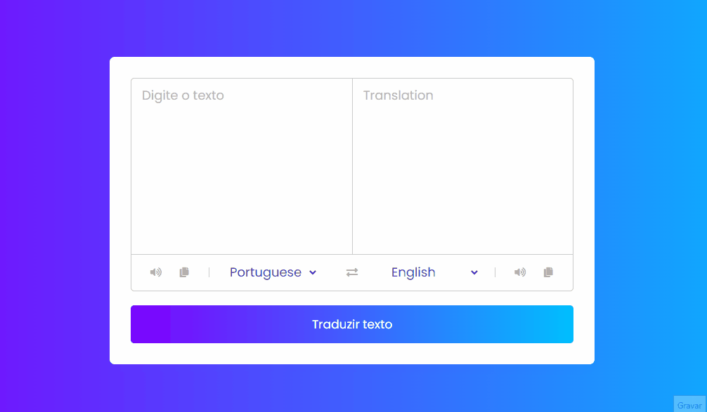

## 🧾 Descrição

Esse é um projeto de tradução de texto online, onde o usuário pode inserir um texto em um idioma e obter a tradução em outro idioma escolhido. O projeto possui uma interface de usuário simples com opções de seleção de idiomas e botões para executar a tradução, além de recursos adicionais como opções de áudio e copiar texto traduzido. O código foi implementado usando HTML, CSS e JavaScript.

<h1>

## 🔌 Tecnologias utilizadas

- **HTML:** linguagem de marcação usada para estruturar e apresentar o conteúdo da página;
- **CSS:** linguagem de estilo usada para estilizar a página, incluindo layout, fontes, cores, etc;
- **JavaScript:** Linguagem de programação que permite criar interações dinâmicas na web. Com ela é possível manipular o conteúdo HTML e CSS em tempo real, validar formulários, criar animações, entre outras possibilidades
- **Google Cloud Translation API:** API utilizada para fazer as traduções, é uma solução de tradução baseada em nuvem da Google.
- **Font Awesome:** Biblioteca Font Awesome para adicionar ícones à interface do usuário.

## ⚙️ Estrutura

- **img:** Contém imagens utilizadas no projeto e para apresentação no Readme.md;
- **index.html:** Contém a linguagem de marcação usada para estruturar e apresentar o conteúdo da página;
- **style.css:** Contém regras de estilo que são usadas para personalizar a aparência da página HTML. Ele inclui configurações de fonte, cor de fundo, posicionamento e tamanho de elementos, e outras propriedades de estilo para tornar a página mais atraente e fácil de usar.
- **script.js:** Responsável pela implementação da lógica do projeto, fazendo a integração entre a API de tradução, os elementos HTML e as funcionalidades do usuário, como, por exemplo, a interação com os botões de controle e a chamada da API para traduzir o texto inserido. Ele também é utilizado para manipular o conteúdo dos elementos HTML e exibir a tradução para o usuário. 
- **countries.js:** Arquivo com dados de todos os países que são usados para preencher as listas suspensas de seleção de idiomas.

## 🏳️ Como executar?

### **Passo 1**
Faça download do repositório

### **Passo 2**
Abra o arquivo "Index.html" em um navegador e teste as funções.

 

## ✅ Resultado (Preview)

### **Tradutor**

 

## 💻 Autor: Luan Ferreira

Portfólio:
- [Github](https://github.com/fluanbrito)

Contato:
- [Linkedin](https://www.linkedin.com/in/luanferreirab/)

<h1>

## 🚀 Sobre mim
Sou um grande entusiasta e apaixonado por tecnologia, empreendedorismo e inovação. Hoje, estou a cursar o curso de Sistema de Informação pelo Instituto Federal, faço uso profissionalmente de ferramentas e me aprofundo em temas como Marketing, Machine Learning AWS, Metodologias ágeis, Gestão de Projetos, Programação Web, Administração de Sistemas, Redes de computadores, entre outros.
